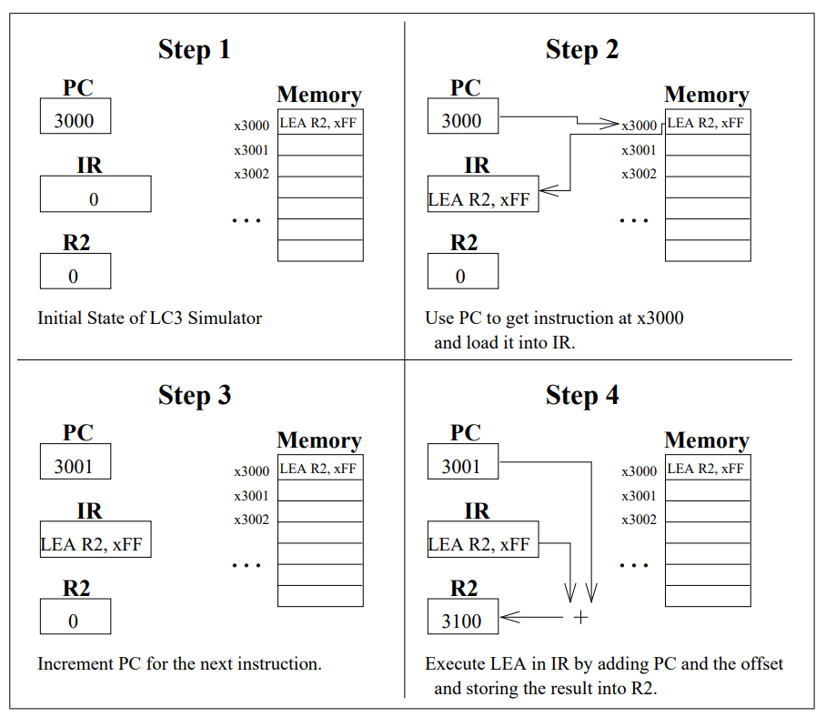
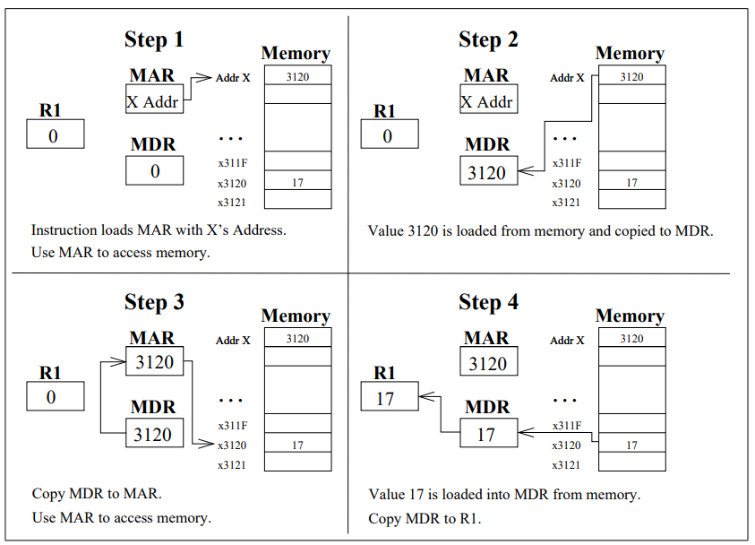
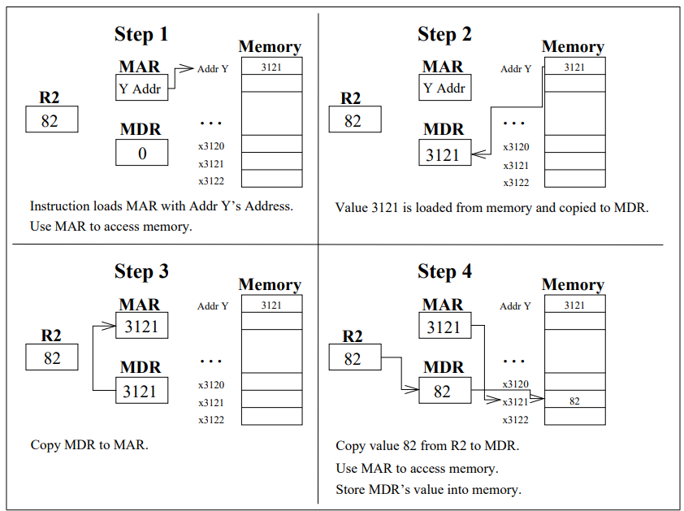
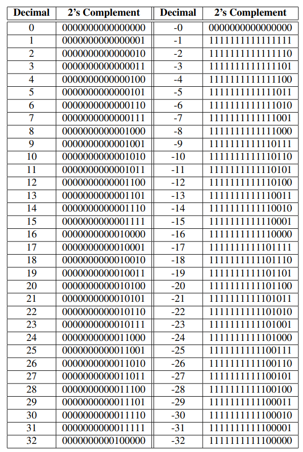

###Author: Tran Minh Nhat (HCMUT)
### LAB 1: 
**ALU Operations**

### 1. Problem Statement
The numbers X and Y are found at locations **x3100** and **x3101**, respectively. Write an LC-3 assembly
language program that does the following.
- Compute the sum X +Y and place it at location **x3102**.
- Compute X **AND** Y and place it at location **x3103**.
- Compute X **OR** Y and place it at location **x3104**.
- Compute **NOT**(X) and place it at location **x3105**.
- Compute **NOT**(Y) and place it at location **x3106**.
- Compute X +3 and place it at location **x3107**.
- Compute Y −3 and place it at location **x3108**.
- If the X is even, place 0 at location **x3109**. If the number is odd, place 1 at the same location.
The operations **AND**, **OR**, and **NOT** are bitwise. The operation signified by + is the usual
arithmetic addition.

#### 1.1 Inputs
The numbers X and Y are in locations x3100 and x3101, respectively


### 1.2 Instruction in LC3



```
    .ORIG x3000
    LD R4, ADDRESS
    LDR R1, R4, #0	;R1: FIRST NUM
    LDR R2, R4, #1	;R2: SECOND NUM
    ADD R3, R1, R2	;R3=R1+R2
    STR R3, R4, x2
    AND R3, R1, R2	;R3=R1 AND R2
    STR R3, R4, x3
    NOT R5, R1
    NOT R6, R2
    AND R3, R5, R6
    NOT R3, R3
    STR R3, R4, x4
    STR R5, R4, x5
    STR R6, R4, x6
    ADD R3, R1, #3
    STR R3, R4, x7
    ADD R3, R2, #-3
    STR R3, R4, x8

    AND R5, R1, #1
    BRz EVEN
    AND R3, R3, #0
    ADD R3, R3, #1
    STR R3, R4, x9
    BR NEXT
EVEN
    AND R3, R3, #0
    STR R3, R4, x9
NEXT	HALT
    ADDRESS	.FILL x3100
    .END
```
____


### LAB 2: 
**Arithmetic functions**

### 1. Problem Statement
The numbers X and Y are found at locations **x3120** and **x3121**, respectively. Write a program in
LC-3 assembly language that does the following:

- Compute the difference X −Y and place it at location **x3122**.
- Place the absolute values |X| and |Y| at locations **x3123** and **x3124**, respectively.
- Determine which of |X| and |Y| is larger. Place 1 at location **x3125** if |X| is, a 2 if |Y| is, or a
0 if they are equal.

#### 1.1 Inputs
The integers X and Y are in locations x3120 and x3121, respectively.

### 2. Instruction in LC3

**The steps taken during the execution of the instruction LDI R1, X**



**The steps taken during the execution of the instruction STI R2, Y**



**Decimal numbers with their corresponding 2’s complement representation**



```
.ORIG x3000
LD R4, ADDRESS
LDR R1, R4, #0
LDR R2, R4, x1
NOT R3, R2
ADD R3, R3, #1
ADD R5, R1, R3	;R5=R1-R2
STR R5, R4, x2

ADD R1, R1, #0
BRzp	POSITIVE1
NOT R1, R1
ADD R1, R1, #1
POSITIVE1 ADD R1, R1, #0
STR R1, R4, x3

ADD R2, R2, #0
BRzp	POSITIVE2
NOT R2, R2
ADD R2, R2, #1
POSITIVE2 ADD R2, R2, #0
STR R2, R4, x4


NOT R5, R2
ADD R5, R5, #1
ADD R6, R1, R5	;R6=ABS(R1)-ABS(R2)
BRp	R1_LARGER
BRz	EQUAL
AND R3, R3, #0
ADD R3, R3, #2
STR R3, R4, x5
BR NEXT
R1_LARGER
AND R3, R3, #0
ADD R3, R3, #1
STR R3, R4, x5
BR NEXT
EQUAL	
AND R3, R3, #0
STR R3, R4, x5
NEXT	HALT

ADDRESS .FILL x3120
.END

```


